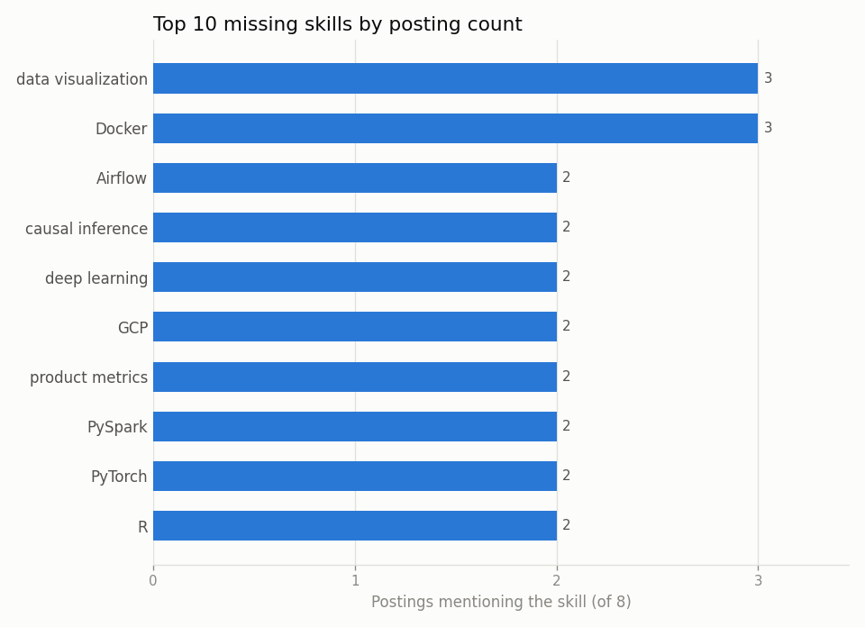

# job-skill-gap


A small Python 3.11 command-line tool that compares a folder of job postings against
your resume skills and ranks the skills you are missing by how many postings ask for
them.

```
postings/*.txt  ─┐
skills.csv      ─┼─► job-skill-gap ─► skill_gap.csv            (every skill, ranked)
resume.txt      ─┘                 ─► top_missing_skills.png   (top 10 missing skills)
                                   ─► summary on stdout
```

IDS 706 · Week 4 · Option 3. The architecture plan is in [`docs/plan.md`](docs/plan.md).

## Quick start

```bash
python3.11 -m venv .venv && source .venv/bin/activate
make install        # pip install -e . + black, flake8, pytest, pytest-cov
make coverage       # optional: pytest with a coverage report
make run            # analyze the sample data into ./output
make all            # format-check + lint + test (same gate as CI)
```

Or with Docker (no local Python needed):

```bash
docker compose run --rm job-skill-gap     # sample data -> ./output
```

## Usage

```bash
job-skill-gap \
  --postings  data/sample/postings \
  --skills    data/sample/skills.csv \
  --resume    data/sample/resume_skills.txt \
  --out-dir   output \
  [--top 10]      # bars in the chart
  [--quiet]       # no summary; warnings still go to stderr
```

`python -m job_skill_gap ...` works the same way.

| Exit code | Meaning |
|-----------|---------|
| `0` | Success, including "no missing skills found" (a warning is printed) |
| `1` | Invalid input data: bad skills CSV header, duplicate skill, alias shared by two skills |
| `2` | Bad path or arguments: missing folder/file, **no `.txt` postings in the folder**, usage errors |

Errors are one line on stderr (`error: No .txt postings found in data/postings`), never
a traceback. All inputs are loaded and validated before the output folder is created,
so a failed run writes nothing.

### Analyze your own postings with Docker

```bash
docker build -t job-skill-gap .
docker run --rm \
  -v "$PWD/my_input:/data/input:ro" \
  -v "$PWD/output:/data/output" \
  job-skill-gap
```

`my_input/` must contain `postings/`, `skills.csv` and `resume_skills.txt`. Sample
data is not baked into the image. If the mount is wrong and the container sees an
empty `/data/input/postings`, it exits with code 2 instead of writing empty results.

## Input formats

**Postings** — every `*.txt` file directly inside the folder (not sub-folders). Other
extensions and hidden files such as `.DS_Store` are ignored. Files are read as UTF-8
(a BOM is fine; undecodable bytes are replaced, not fatal).

**Skills dictionary** — CSV with header `skill,category,aliases`. Aliases are
`|`-separated and may be empty. The skill name always counts as its own alias.

```csv
skill,category,aliases
scikit-learn,data & ml,sklearn|scikit learn
R,programming,R programming|RStudio|R language
SQL,programming,
```

**Resume** — one skill per line; blank lines and `#` comments are ignored. Resume lines
go through the same alias table, so `sklearn` counts as `scikit-learn`. Lines that are
not in the dictionary are listed as a warning, not an error.

## How matching and scoring work

- **Case-insensitive, word-boundary-safe matching.** Each alias is wrapped in
  `(?<![A-Za-z0-9_]) … (?![A-Za-z0-9_])` instead of `\b`, so `C++`, `C#` and `.NET`
  still match while `R` does not match `React`, `Java` does not match `JavaScript`,
  `SQL` does not match `NoSQL`, and `Spark` does not match `PySpark`. Spaces inside an
  alias match any whitespace, including line breaks.
- **Counted once per posting.** A posting that says "Python" five times, or both
  "sklearn" and "scikit-learn", adds 1 to that skill.
- **Gap score** = `posting_count / total_postings` if the skill is **not** on your
  resume, otherwise `0`. Rounded to 3 decimals, always in `[0, 1]`. The formula lives
  in one function, `analysis.gap_score()`.
- **Ranking** = `posting_count` desc → missing before owned → skill name A–Z. Same
  inputs always give a byte-identical CSV.

## Output

`skill_gap.csv` — one row per dictionary skill, including skills no posting mentions:

```csv
rank,skill,category,posting_count,posting_pct,have_skill,gap_score
1,Python,programming,6,0.750,true,0.000
2,SQL,programming,6,0.750,true,0.000
3,A/B testing,data & ml,4,0.500,true,0.000
4,statistics,data & ml,4,0.500,true,0.000
5,data visualization,analytics & bi,3,0.375,false,0.375
6,Docker,engineering,3,0.375,false,0.375
...
```

`top_missing_skills.png` — the top 10 missing skills (`have_skill = false`,
`posting_count > 0`). When nothing is missing, a placeholder chart saying
"No missing skills found" is written so a successful run always produces both files.



Terminal summary on the sample data:

```text
job-skill-gap: 8 postings analyzed
  Skills matched:  42 of 44 dictionary skills appear in at least one posting
  Already have:    16 of 42 in-demand skills are on your resume

Top 5 gaps:
  1. data visualization  3/8 postings (37.5%)
  2. Docker              3/8 postings (37.5%)
  3. Airflow             2/8 postings (25.0%)
  4. causal inference    2/8 postings (25.0%)
  5. deep learning       2/8 postings (25.0%)

Output files:
  CSV: output/skill_gap.csv
  Chart: output/top_missing_skills.png

Warnings:
  - Postings with no recognized skills: 07_ai_pm_intern_enterprise.txt
  - Resume terms not in dictionary: Wind API
```

## Sample data

`data/sample/` holds 8 data-science / AI-product internship postings, a 44-skill
dictionary and a resume. **The postings are synthetic — I wrote them to exercise the
pipeline, so the counts reflect my assumptions, not the job market.** They
deliberately include the edge cases the tests rely on:

| Posting | Edge case |
|---------|-----------|
| `01_ds_intern_fintech.txt` | says "Python" many times → counts once |
| `02_ml_intern_ecommerce.txt` | says only "sklearn" → counts as `scikit-learn` |
| `03_ai_product_intern_consumer.txt` | mentions React, not R → `R` not counted |
| `07_ai_pm_intern_enterprise.txt` | no dictionary skill at all → warning |

## Project layout

```
src/job_skill_gap/
  models.py      frozen dataclasses (Skill, Posting, SkillStat, AnalysisResult)
  dictionary.py  load + validate skills CSV
  matcher.py     alias regexes; text -> set of skills; resolve one term
  loader.py      postings folder + resume file
  analysis.py    counts, gap score, ranking, warnings (pure)
  report.py      CSV, PNG (matplotlib Agg), summary text
  cli.py         argparse, wiring, exit codes
tests/           pytest suite (one file per module + end-to-end CLI)
data/sample/     sample postings, skills.csv, resume_skills.txt
```

`matcher` and `analysis` do no file IO, so most tests run without touching disk.

## Development

| Command | What it does |
|---------|--------------|
| `make install` | `pip install -e .` + dev requirements |
| `make format` / `make format-check` | black |
| `make lint` | flake8 (max line 88, E203/W503 ignored) |
| `make test` | pytest (no plugins needed) |
| `make coverage` | pytest with a pytest-cov line-coverage report |
| `make run` | CLI on the sample data |
| `make docker-build` / `make docker-run` | build image / `docker compose run` |
| `make clean` | remove caches and generated output |
| `make all` | format-check + lint + test |

CI (`.github/workflows/ci.yml`) runs on every push and pull request: a **quality** job
(black check, flake8, pytest) and a **docker** job that builds the image,
runs it on the sample data, checks both output files exist, and checks that an empty
postings mount fails with exit code 2.

## Known limitations

- **Short or common-word skills can false-positive.** Matching is case-insensitive, so
  `R` also matches "R&D", and `Excel` would match "excel at". `Go` is left out of the
  sample dictionary for this reason. Choose aliases with care.
- **The dictionary owns the semantics.** "PostgreSQL" does not count as `SQL` unless
  you list it as an alias. Overlapping skills (`machine learning` and `deep learning`)
  are both counted.
- **Hyphen/spacing variants are aliases, not automatic.** `scikit learn` matches only
  because it is listed. Whitespace inside an alias is flexible; hyphens are not.
- **Plain English text only.** No PDF/DOCX parsing, no scraping.
- On Linux hosts, Docker writes `./output` files as root; see the commented `user:` line
  in `docker-compose.yml`.

## Future work

Optional `case_sensitive` column for short skills like `R`; category weights in the gap
score; PDF/DOCX posting input; fuzzy or embedding-based matching.
